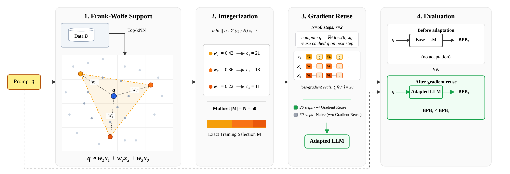

# HullFT

**[📰 Paper](https://arxiv.org/abs/2605.30337)** | **[💻 Code](https://github.com/alaa-khamis/HullFT)**

#### Efficient Test-Time Finetuning of LLMs via Convex Reconstruction and Gradient Caching.

✍️ _Alaa Khamis and Alaa Maalouf_ ✍️



_HullFT_ is a geometric approach to test-time finetuning (TTFT) that addresses
both selection and finetuning bottlenecks. It reconstructs each prompt embedding
as a sparse convex combination of retrieved training examples, converts the
fractional weights into an exact finetuning multiset, and reuses gradients
across repeated examples to improve the quality-efficiency tradeoff.

## 🤔 Method Summary

1. **Frank-Wolfe selection:** Find a sparse convex combination of pool
   embeddings that approximates the query embedding. Support is `<= N_iter`.
2. **Geometry-aware integerization:** Round the convex weights to integer counts
   that minimize `|| target - sum_i (c_i / N) x_i ||^2` via floor + greedy +
   local swap refinement, then repeat each support point by its count to land
   at exactly `N` instances.
3. **Gradient-refresh finetuning:** For each unique selected text with
   multiplicity `J`, recompute the gradient every `r` steps and reuse the
   cached gradient for the other `r-1` steps. Default `r = 2`.

## 📁 Layout

```text
hullft/         runtime package (no FAISS imports)
data/           offline precompute scripts (FAISS + HuggingFace Pile)
experiments/    one config + launcher per paper experiment
```

The runtime is **precomputed-only**: at experiment time, candidate pools (and
optionally their embeddings) come from JSON / NPZ files produced by
`data/precompute_candidates.py` and `data/precompute_embeddings.py`. RoBERTa
is loaded at runtime only when the precomputed file lacks embeddings.

## 🛠️ Installation

```bash
pip install -e .
# GPU FAISS (optional, only needed for offline precompute):
pip install -e ".[gpu]"
```

## 📊 Data Pipeline

All commands are run from the repo root. The default subset is `ArXiv`; see
each experiment README for how to swap it.

```bash
# 1. Download the pile-uncopyrighted test split.
python -m data.ensure_test_jsonl --test_dir data/pile/test

# 2. Stream the pile train split and build a FAISS index (long step;
#    parallelize per subset if needed).
python -m data.build_train_index \
    --subsets "ArXiv" \
    --output_dir data/pile/train

# 3. Precompute candidate pools (150 queries x 200 candidates).
python -m data.precompute_candidates \
    --train_index_dir data/pile/train \
    --test_dir data/pile/test \
    --output_dir data/pile/precomputed \
    --subsets "ArXiv" \
    --n_queries 150 \
    --k_candidates 200 \
    --seed 42

# 4. (Optional) precompute query + candidate embeddings so RoBERTa is
#    not loaded at runtime.
python -m data.precompute_embeddings \
    --input_dir data/pile/precomputed \
    --output_dir data/pile/precomputed_embeddings \
    --subsets "ArXiv"
```

## 🚀 Experiments

```bash
python experiments/main_sweep/launch.py           --config experiments/main_sweep/config.yaml
python experiments/cpu_test/launch.py             --config experiments/cpu_test/config.yaml
python experiments/sift_gradient_reuse/launch.py  --config experiments/sift_gradient_reuse/config.yaml
```

See `experiments/<name>/README.md` for what each one does, its inputs, and how
to swap the subset / dataset. Baselines: `knn` (top-N by inner product) and
`sift` (SIFT selector).

## 🔄 Reproducibility

Every run calls `hullft.reproducibility.set_global_determinism(seed)` at entry.
That sets `random`, `numpy`, `torch.manual_seed`, `torch.cuda.manual_seed_all`,
`cudnn.deterministic=True`, `torch.use_deterministic_algorithms(True)`,
`CUBLAS_WORKSPACE_CONFIG=:16:8`, and `PYTHONHASHSEED`.

The `precompute_embeddings.py` script reproduces the runtime's *exact*
embedding shape (`embed_query(text)` per query,
`embed_texts(candidates, batch_size=32)` per query). Changing either side
breaks parity because fp32 GEMM is not shape-invariant.

## 🖋️ Citation

Please consider citing our paper if this code helps your research.

```bibtex
@article{khamis2026efficient,
  title={Efficient Test-Time Finetuning of LLMs via Convex Reconstruction and Gradient Caching},
  author={Khamis, Alaa and Maalouf, Alaa},
  journal={arXiv preprint arXiv:2605.30337},
  year={2026}
}
```